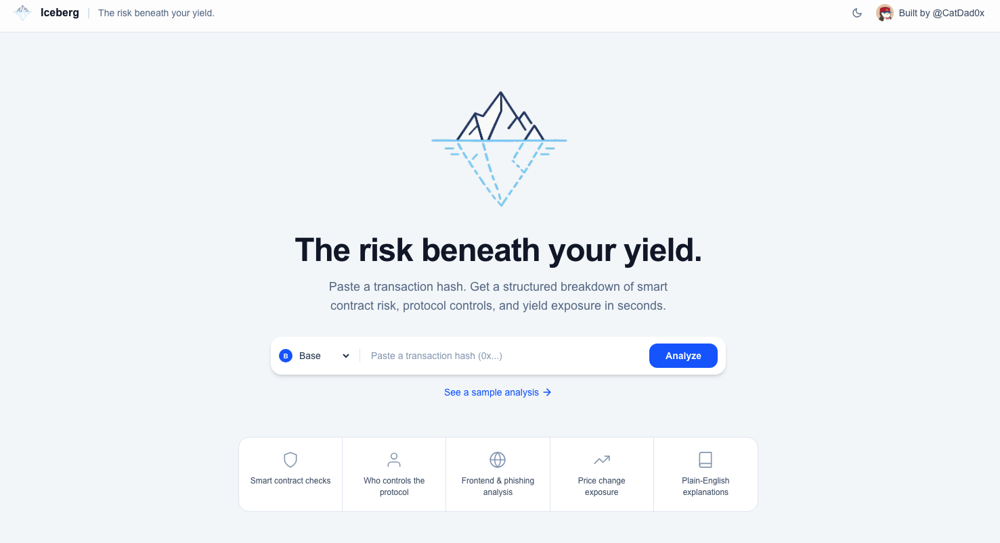
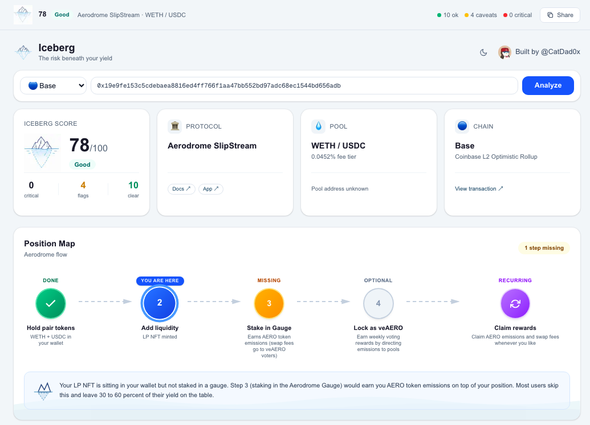
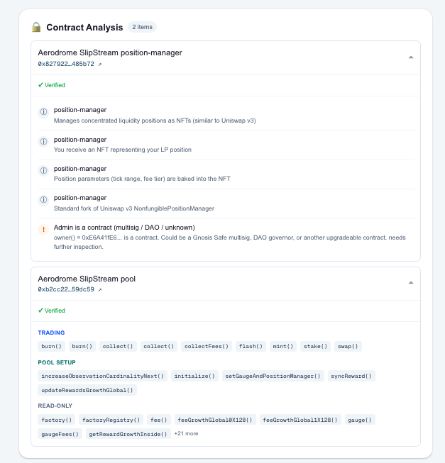
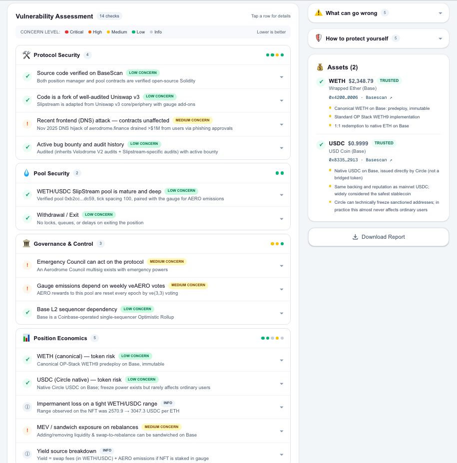

# Iceberg — DeFi Risk Analysis

> **The risk beneath your yield.**

Iceberg is a free, open-source due diligence tool for DeFi users. Paste a transaction hash or pool address — get a structured, plain-English risk report covering smart contract security, protocol governance, and yield exposure in seconds.

**Live:** [iceberg.finance](https://iceberg.finance) &nbsp;·&nbsp; Built by [@CatDad0x](https://x.com/CatDad0x)

---

## Why This Exists

The biggest barrier to DeFi adoption isn't gas fees or wallet setup — it's that users have no way to understand what they're actually putting their money into before they do it.

A new user on Base or Ethereum looks at a pool offering 40% APY and has no idea whether:
- The contracts have ever been audited
- A single wallet can drain the pool overnight
- The protocol was hacked three months ago
- The "yield" is just inflationary token emissions

They either skip the opportunity entirely, or they ape in blind. Both outcomes are bad for the ecosystem.

Iceberg fixes this. In 30 seconds, any user — regardless of technical background — can get a full, plain-English breakdown of the risks in any DeFi position.

---

## For Chain Grant Reviewers

Iceberg is purpose-built as an **ecosystem educational tool**. Here is why that matters for your chain:

### Users who understand risk stay longer
Educated users make better decisions, lose money less often to exploits and scams, and build higher trust in the ecosystem. Retention goes up. Churn from "I got rugged" goes down.

### It reduces exploit damage
When Iceberg flags that a protocol has a single-wallet admin key or an unaudited contract, users think twice. Fewer users in high-risk protocols = less value lost when exploits happen = less reputational damage to your chain.

### It accelerates onboarding
New users coming from TradFi or CeFi are not comfortable with "DYOR". Iceberg gives them a concrete, structured answer to "is this safe?" — the same question they would ask a financial advisor. It removes a major psychological barrier to first deployment.

### It scales with the ecosystem
Every analysis is cached by contract set. The more users run analyses, the more pools get covered — building a shared, growing knowledge layer of risk intelligence that benefits the entire chain. It is a public good with network effects.

### Multi-chain expansion roadmap
Iceberg currently supports **Ethereum** and **Base**. Chains on the expansion roadmap include:

| Chain | Status |
|---|---|
| Ethereum | ✅ Live |
| Base | ✅ Live |
| Arbitrum | Planned |
| Optimism | Planned |
| Polygon | Planned |
| Solana | Planned |

Grant support accelerates a chain moving from Planned to Live. Integration includes native RPC support, block explorer API, protocol registry, and chain-specific risk checks.

---

## What It Analyses

Every analysis covers four risk categories, each individually scored and weighted into an **Iceberg Score out of 100**:

| Category | Weight | What We Check |
|---|---|---|
| **Protocol Security** | 50% | Source verified, audit history, exploit history, upgradeable proxies |
| **Governance & Control** | 25% | Admin key ownership — single wallet, multisig, or DAO with timelock |
| **Pool Security** | 15% | Pool age, kill switch risk, withdrawal locks, oracle dependency |
| **Position Economics** | 10% | IL exposure, MEV risk, inflationary token risk, price correlation |

Results are written in plain English — no technical jargon required to understand the output.

---

## How It Works

### 1. Decodes the transaction
When a tx hash is pasted, the backend calls the blockchain node directly, pulls the full receipt, and parses every log event to extract which contracts were touched and which tokens moved.

### 2. Pulls verified source code
Etherscan API is called for each contract — pulling verified source code, ABI, deployment date, and creator address. If source is unverified, that itself is flagged as a risk.

### 3. Reads live on-chain state
Live RPC calls check things like: who the current owner is, whether the contract is paused, whether a pending admin transfer is queued, and whether a timelock protects governance actions.

### 4. Cross-references exploit history
DeFiLlama's hacks database is queried to surface any historical exploits for the protocol, displayed in a timeline with amounts lost.

### 5. AI research pass
Claude runs a web research pass — finding audit reports on GitHub, exploit write-ups on Rekt News, recent governance changes — and synthesises everything into a cited, plain-English narrative.

---

## Contract Analysis

For every contract touched in the transaction:
- Source code verification status
- Admin key ownership (EOA, multisig, DAO, or renounced)
- Proxy / upgradeability detection
- Function categories (trading, pool setup, admin, read-only)
- Deployment age and creator address
- Live pool reserves and TVL

---

## Exploit History Timeline

Historical exploits are pulled from DeFiLlama's hacks database and shown in a timeline — date, amount lost, and description — so users can see whether a protocol has a clean track record or a history of security incidents.

---

## Smart Caching — Public Good Economics

AI analysis costs real money per call. Iceberg fingerprints each analysis by chain + the exact set of contracts and tokens involved.

- Two different users analysing the same pool share the same cache — the second user gets the full result instantly at zero marginal cost
- Cache lives for 30 days
- Every new analysis permanently adds to the shared knowledge layer
- The more the ecosystem uses it, the cheaper and faster it gets for everyone

This is how it operates as a genuinely sustainable public good rather than a paid product.

---

## Supported Protocols

Iceberg analyses any pool or gauge on supported chains. It has first-class support for:

**Base:** Aerodrome, Uniswap V3, Curve, Equalizer
**Ethereum:** Velodrome, Balancer, SushiSwap, PancakeSwap, Uniswap V3, Curve

Any address or tx hash can be pasted — unsupported protocols still receive a full generic contract and governance analysis.

---

## Tech Stack

| Layer | Technology |
|---|---|
| Frontend | Next.js 16, TypeScript, Tailwind CSS |
| Blockchain | ethers.js v6, Etherscan V2 API, public RPC |
| AI | Claude (Anthropic) with web search |
| Data | DeFiLlama Hacks API, Snapshot governance API |
| Chains | Ethereum, Base |

---

## Roadmap

- [ ] Lending protocols (Aave, Morpho, Compound)
- [ ] Yield aggregators (Beefy, Yearn, Pendle)
- [ ] Arbitrum, Optimism, Polygon support
- [ ] Solana support
- [ ] Telegram / Discord bot
- [ ] Progressive streaming results
- [ ] Wallet history scanner (analyse all recent positions)

---

## Get In Touch

Interested in a grant partnership, integration, or collaboration?

**Twitter/X:** [@CatDad0x](https://x.com/CatDad0x)

---

*Not financial advice. Verify all findings independently.*
